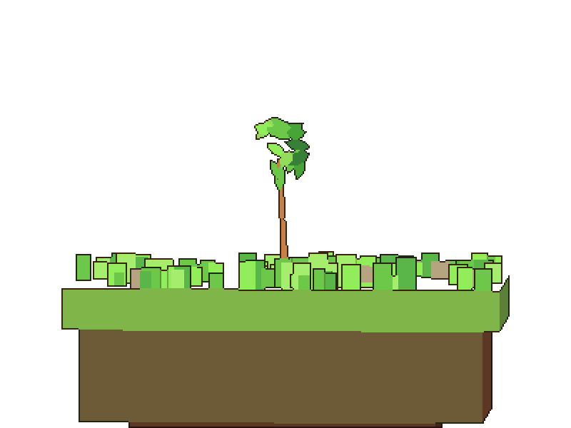
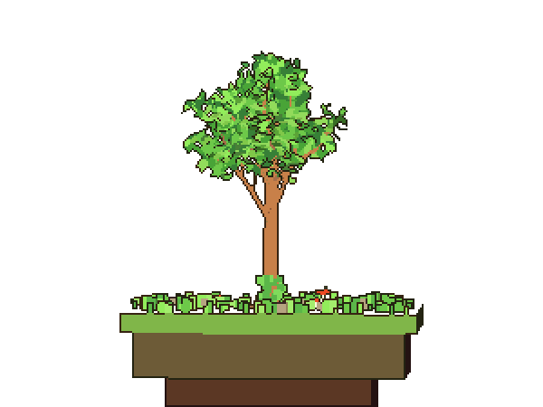
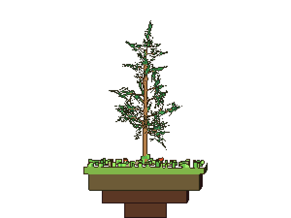
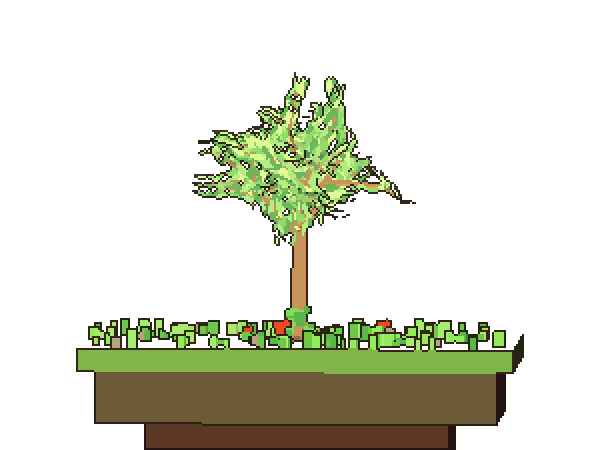
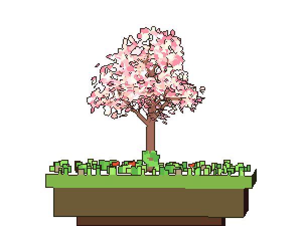
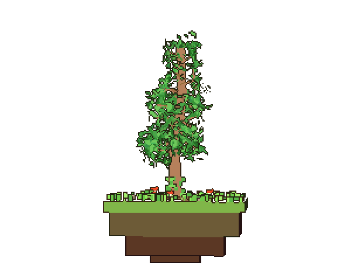
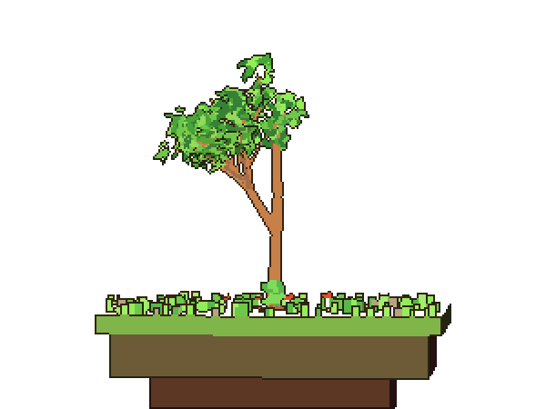

# Lockwood

Grow a pixel-art tree from your lockfile.

<p align="center">
  
  <br>
  
  <br>
  <sub>This is Lockwood's own tree, rendered from this repository's <code>package-lock.json</code> by the GitHub Action below. It has no dependencies, so it is a sapling.</sub>
</p>

Each package in a lockfile becomes a branch, each level of nesting a fork, and packages that depend on nothing become leaves. Trees age with their dependency count, from a thin sapling to a gnarled 500-year oak with surface roots, moss and mushrooms.

Lockwood is three things in one small repository:

- **A web app** ([`index.html`](index.html)): paste or drop a lockfile, hover a branch to trace what it needs and who needs it, switch between five tree styles.
- **A CLI** (`bin/lockwood.js`): renders the same tree to PNG or SVG with no browser and no dependencies, for READMEs and CI.
- **A GitHub Action** ([`action.yml`](action.yml)): renders your repository's tree on every lockfile change and commits the image.

## Put your tree in your README

Add a workflow to your repository:

```yaml
# .github/workflows/dependency-tree.yml
name: Dependency tree
on:
  push:
    branches: [main]
    paths: [uv.lock, package-lock.json, bun.lock, yarn.lock, pnpm-lock.yaml, poetry.lock, Pipfile.lock, Cargo.lock, Gemfile.lock, composer.lock]
  workflow_dispatch:
permissions:
  contents: write
jobs:
  tree:
    runs-on: ubuntu-latest
    steps:
      - uses: actions/checkout@v4
      - uses: LuckyType/lockwood@main
        with:
          style: oak            # oak | pine | willow | sakura | bonsai
          badge: .github/lockwood/badge.svg
```

Then embed the image it commits:

```markdown


```

The action finds the first supported lockfile in the repository root, renders it to `.github/lockwood/tree.png`, and pushes a commit only when the image changed. Commits made with the workflow's own token do not trigger further workflow runs, so there is no loop.

| Input | Default | Meaning |
| --- | --- | --- |
| `lockfile` | auto-detect | Path to the lockfile |
| `output` | `.github/lockwood/tree.png` | Image to write (`.png` or `.svg`) |
| `badge` | none | Also write a shields-style SVG badge |
| `style` | `oak` | `oak`, `pine`, `willow`, `sakura` or `bonsai` |
| `width`, `height` | `400`, `300` | Pixel grid before scaling |
| `scale` | `2` | Nearest-neighbour upscale of the written image |
| `background` | `transparent` | `transparent`, `sky`, or `#rrggbb` |
| `seed` | `0` | `0` is the canonical tree; any other number grows a different one |
| `commit` | `true` | Commit and push when the image changed |
| `commit-message` | `chore: update dependency tree` | Commit message |

## Render locally

```bash
npx github:LuckyType/lockwood --lock uv.lock --out tree.png
```

Or from a clone, with Node 18 or newer and nothing to install:

```bash
node bin/lockwood.js --lock package-lock.json --style pine --out tree.svg --badge badge.svg
```

`--help` lists every option. `--json` prints the tree's stats (format, package count, depth, age) instead of the summary line.

## Supported lockfiles

| Ecosystem | File | Notes |
| --- | --- | --- |
| uv (Python) | `uv.lock` | Workspace members share one trunk; dev groups and extras are tagged |
| Poetry (Python) | `poetry.lock` | Dev group packages tagged |
| Pipenv (Python) | `Pipfile.lock` | Flat: Pipenv records no dependency graph |
| npm | `package-lock.json` | Lockfile versions 1, 2 and 3 |
| Bun | `bun.lock` | Text lockfile (Bun 1.2+) |
| Yarn | `yarn.lock` | Classic (v1) and Berry (v2+) |
| pnpm | `pnpm-lock.yaml` | v5 to v9, including workspaces |
| Cargo (Rust) | `Cargo.lock` | Workspace crates become roots |
| Bundler (Ruby) | `Gemfile.lock` | `DEPENDENCIES` section becomes the trunk |
| Composer (PHP) | `composer.lock` | `packages-dev` tagged; platform requirements skipped |

The format is detected from the content, not the file name. Lockfiles that do not record a root (Yarn classic, Poetry, Composer) get a synthetic root whose branches are the packages nothing else depends on.

## Gallery

The same 50-package `uv.lock` in each style:

| Oak | Pine | Willow |
| --- | --- | --- |
|  |  |  |

| Sakura | Bonsai | npm (37 packages) |
| --- | --- | --- |
|  |  |  |

## The web app

Open [`index.html`](index.html) from any static server (it loads three.js from a CDN and imports `src/` as ES modules, so it needs `http://`, not `file://`):

```bash
python3 -m http.server 8000
```

- **Hover tracing:** the hovered package turns gold, its full transitive dependencies green, everything that needs it blue. Click to pin, Escape to clear.
- **Flat 2D or orbit 3D:** the 2D view is what the CLI renders. The 3D view lets you orbit the tree.
- **Regrow:** rolls a new seed for a different tree from the same lockfile. The status line shows the seed, and `--seed` reproduces it with the CLI.
- **Samples:** every supported format has a built-in sample, plus two synthetic locks with 160 and 420 packages to show the age range.

## How the tree is built

1. The lockfile is parsed into a package graph ([`src/lockfile.js`](src/lockfile.js): a small TOML reader, a lenient JSON reader, a YAML subset, and line parsers for Yarn classic and Bundler).
2. Root projects become the trunk; a workspace with several members shares one trunk.
3. A breadth-first spanning tree decides which branch each package hangs from. Branch length and radius follow subtree size; the age (years, trunk segments, roots, moss) follows package count ([`src/layout.js`](src/layout.js)).
4. The browser turns the layout into three.js objects and animates growth: branches extend and thicken, children sprout early and ride up the growing shoot, leaves unfurl last. The CLI rasterizes the same layout with a small software renderer ([`src/raster.js`](src/raster.js)) that reproduces the orthographic view, three-band toon shading and inked outline.

Every angle and timing is seeded from package names, so the same lockfile and seed always grow the same tree.

## Development

```bash
npm test            # parses every sample lockfile and renders each one
node test/gallery.js  # re-renders the README gallery into docs/
```

Pull requests welcome, especially new lockfile formats: add a parser in `src/lockfile.js`, a fixture in `samples/`, and its expected shape in `test/run.js`.

## License

MIT
